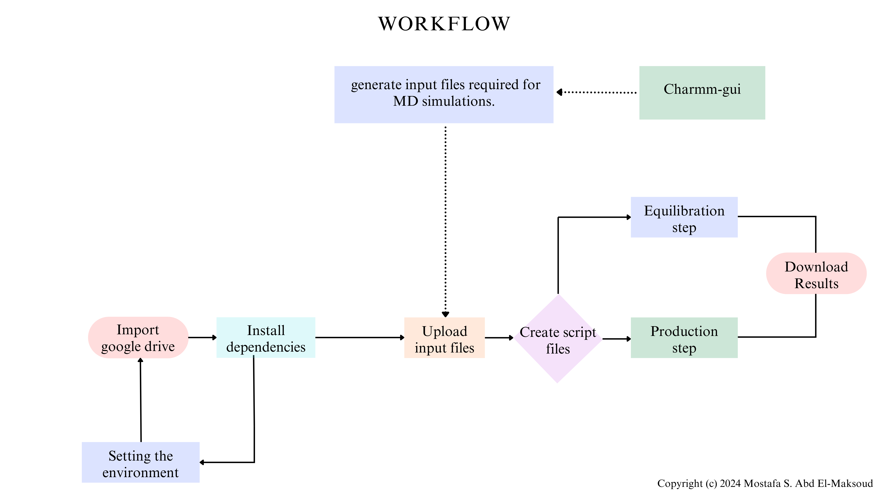

 

## Hello there!

- Welcome to Colab_NAMD_suit, your gateway to running powerful MD simulations! 
This repository provides a comprehensive setup for leveraging the computational power of Google Colab to perform MD simulations efficiently and cost-effectively.
- This repository is where you can find a Jupyter Notebook script for running Molecular Dynamics (MD) simulations using NAMD (Nanoscale Molecular Dynamics) for **Protein and Ligand** systems on Google Colab. I encourage you to watch this [tutorial](https://youtu.be/) before using this pipeline.

---

> [!IMPORTANT]
> - Don't  `Run all` cells at the beginning. Run the cells individually and wait for the session to restart.
> - This notebook is designed for `Google Colab` and may not work on `other platforms`.
> - This notebook provides a simple pipeline for illustrating MD simulation and `doesn't necessarily reflect the standard protocol`.
> - This notebook used input files generated by the `charmm-gui` website.
> - Don't forget to `save a copy from this notebook` in your drive before starting.

---
**Introduction**
- MD simulation is a powerful computational technique used in various fields like chemistry, biology, physics, and materials science to study the behavior of atoms and molecules over time. It provides insights into the dynamics and interactions of molecules at the atomic level, which are often difficult or impossible to observe directly in experiments.

- Integrating various tools and platforms like CHARMM-GUI, Google Drive, Google Colab, and NAMD can significantly enhance the efficiency, accessibility, and overall experience of running MD simulations. This integrated workflow leverages the strengths of each component to provide a powerful solution for researchers. 

---

---
**Tools and Platforms**
1. CHARMM-GUI:
- CHARMM-GUI provides an intuitive web-based interface for preparing complex molecular systems. It automates the generation of input files required for MD simulations, ensuring that the system is properly parameterized and ready for simulation.

2. Google Drive:
- Google Drive offers secure and accessible cloud storage for all input and output files. By storing files on Google Drive, researchers can easily share data, collaborate with others, and ensure their files are safely backed up.

3. Google Colab:
- Google Colab provides free access to powerful computational resources, including GPUs essential for running computationally intensive MD simulations. It also offers an interactive environment for scripting and executing simulations.

4. NAMD:
- NAMD is a widely used and highly optimized MD simulation engine known for its efficiency in handling large biomolecular systems. Integrating NAMD with Google Colab enables researchers to perform large-scale simulations without needing local high-performance computing resources.

---
**Advantages**

1. Cost-Effective: Google Colab provides free access to computational resources, including GPUs and TPUs, which can significantly accelerate MD simulations without the need for expensive local hardware.

2. Accessibility: Colab is cloud-based, so you can access it from any device with an internet connection. This allows for greater flexibility and ease of access to your simulations and data.

3. Ease of Use: Google Colab offers an interactive environment with support for Python, making it user-friendly for setting up, running, and analyzing MD simulations. It integrates well with popular MD simulation libraries and tools, such as GROMACS, AMBER, and OpenMM.

4. Collaboration: Colab notebooks can be easily shared and collaborated on in real time. This is particularly useful for research groups or collaborative projects, allowing multiple users to work on the same simulation and share results effortlessly.

5. Scalability: With Google Colab, you can leverage powerful GPUs to run larger and more complex simulations than what might be feasible on a standard personal computer. This scalability can lead to faster simulation times and the ability to handle more extensive systems.

6. Integrated Environment: Google Colab integrates with Google Drive, making it easy to store and manage your simulation data. You can also use Colab to preprocess your data, run the simulations, and perform post-simulation analysis all within the same environment.

7. Up-to-date Software: Colab notebooks often come pre-installed with the latest versions of popular scientific libraries and tools, ensuring that you have access to the latest features and improvements without needing to handle installations and updates manually.

8. Automation and Reproducibility: Colab's notebook interface allows for the creation of well-documented, reproducible workflows. You can automate your simulations and analysis, making it easier to reproduce and verify your results.

---
## License
Copyright (c) 2024 [Mostafa S. Abd El-Maksoud](https://github.com/mabdelmaksoud53) \
Distributed under the MIT License.
